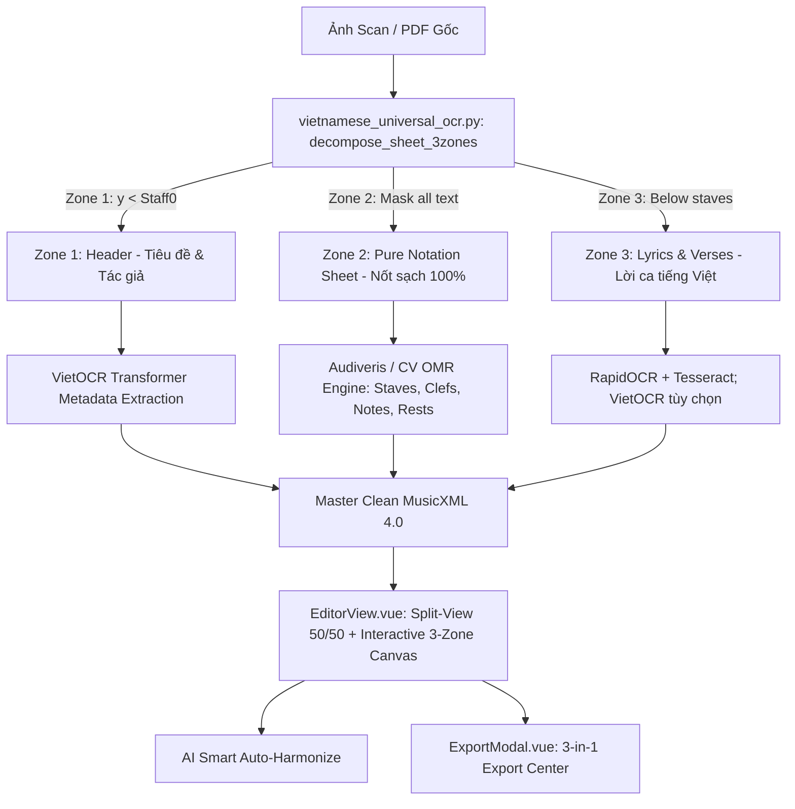

# GITNEXUS CODEBASE KNOWLEDGE GRAPH & ARCHITECTURE REGISTRY

> **Dự án:** Sheet Converter  
> **Kiến trúc:** Clean MVC + Domain-Driven Services + Worker Pipeline + Component-based Frontend  
> **Tiêu chuẩn:** Zero-server Code Intelligence & Comprehensive Graph Index  
> **Trạng thái:** Toàn bộ 7 Phases (Phase 0 -> Phase 6) đã hoàn thành và kiểm thử thành công.

---

## 1. SƠ ĐỒ KIẾN TRÚC TOÀN DIỆN (FULL SYSTEM ARCHITECTURE GRAPH)

## Current verification note (2026-09-24)

- The historical completion claim above is not a current full-suite certification.
- API boundaries now include configurable CORS, optional bearer-token authentication, upload/download allowlists, MusicXML root validation, and a status-transition allowlist.
- Source files use canonical `source/original.<ext>` names. MusicXML locators reject invalid IDs and do not fall back to another part/note.
- MXL extraction rejects unsafe archive paths; experimental CV fallback requires `ENABLE_EXPERIMENTAL_CV_FALLBACK=1`; UUIDs use `random_bytes()`.
- Verification: all 12 PHP suites passed. The 15 Python suites were not executed because Python and Docker CLI were unavailable. This is not a full-suite PASS declaration.

## V2 document intake increment (2026-10-03)

- `ImagePreprocessService` passes the configured 50-page limit to `workers/preprocessing/extract_pdf.py` and uses the configured Python binary.
- The extractor checks page count before rendering, publishes each page PNG atomically, and removes stale numbered PNGs after a successful render. The source PDF is read only.
- `tests/Python/PdfExtractionTest.py` covers the 50-page boundary, early rejection at 51 pages, and ordered page artifacts with a fake renderer. `tests/run_all.php` now accepts `PYTHON_BIN` for the Python suites.
- The upload boundary is now 50 MB, matching the Docker PHP limit and the upload UI.
- Verification on this Windows host with OpenCV, Pillow and PDFium available through `uv`: 12 PHP suites and 14 Python suites passed (26/28); the new extractor suite passed. One sample PDF rendered at 300 DPI. The remaining failures are `ZipInputTest.py` (missing `extract_zip_pages`) and `ValidatorDurationTest.py` (duration warnings). Full V2 acceptance, including a 50-page document and segmentation accuracy, is not yet established.

## V2 page retry and render reuse (2026-10-03)

- `workers/preprocessing/extract_pdf.py` is the sole PDF renderer for PHP intake and standalone OMR. It closes page, bitmap, image, and document resources after rendering. `list_rendered_pages()` requires a contiguous numbered sequence.
- `ImagePreprocessService` writes `pages/page-manifest.json` after complete extraction (`source_sha256`, `page_count`, `dpi`). A targeted retry reuses pages only when the source hash and all numbered artifacts match.
- `AudiverisOmrEngine` passes the canonical project pages directory and optional zero-based retry page index to `audiveris_runner.py`. The worker hashes each page before loading its checkpoint and runs OMR again only for the requested page; other valid page checkpoints are reused.
- `JobQueueService` stores the optional page index. `POST /api/conversions/{uuid}/pages/{index}/retry` enqueues a page retry; `workers/job_worker.php` forwards it to `ConversionService`.
- Coverage: `tests/Python/PageSourceTest.py`, expanded `PdfExtractionTest.py`, `tests/Unit/ImagePreprocessServiceTest.php`, and `tests/Integration/PageRetryPipelineTest.php`. An actual synthetic 50-page blank PDF rendered to 50 PNGs at 300 DPI in about 4 seconds on this host. This measures document extraction only, not OMR accuracy.
- `workers/page_progress.py` atomically writes `omr_out/page_progress.json` with completed, current, and failed page counts. `GET /api/conversions/{uuid}/page-progress` exposes it; `App.vue` polls it while OMR runs and `ProcessingView.vue` displays real page counts. `tests/Python/PageProgressTest.py` and `PageWorkerRetryTest.py` cover progress and selective checkpoint reuse.
- Intermediate verification before the layout and ZIP increments: 31/33 PHP/Python suites passed. No Audiveris/Java run or real 50-page sheet OMR accuracy measurement has been completed on this host.

## V2 page layout debug increment (2026-10-03)

- `workers/preprocessing/page_layout.py` reuses `ComputerVisionOmrEngine.detect_staves()` to emit page-local staff candidates, system groups, conservative header/music/lyrics candidate regions, confidence, and warnings. It writes `page_NNN_regions.json` and `page_NNN_regions_debug.png` beside each page's OMR outputs; the OMR runner invokes it after preprocessing without making a layout failure fatal to OMR.
- `PageArtifactService::resolveLayout()` and `GET /api/conversions/{uuid}/pages/{index}/regions[-debug]` expose the generated artifacts for review.
- Synthetic layout tests pass. On the existing sample `public/samples/2.pdf`, the analyzer found 8 staff systems; visual inspection of its overlay showed 8 music rows and corresponding lyric gaps. This is a debug result, not a measured segmentation accuracy claim.
- `workers/preprocessing/extract_zip.py` restores ZIP image-page extraction through an in-memory reader that never joins archive member paths to the output directory. `ZipInputTest.py` now passes, including an archive member named `../page-2.png` without filesystem traversal.
- With the declared Python test dependencies (`music21` included) available through `uv`, the current suite is **34/34 passing** and the frontend production build passes. The earlier `ValidatorDurationTest.py` failure was due to missing `music21` in the ad hoc test environment, not a validator regression. Full OMR accuracy on real multi-page scores remains unmeasured on this host.
- `workers/preprocessing/pipeline.py` can now write `01_original.png` through `05_normalized.png` (including a threshold preview) in a per-page debug directory; PHP image intake and the OMR worker enable this output. `PreprocessDebugTest.py` checks the artifacts. Current suite after this increment: **35/35 passing**. The footer candidate in layout output now separates the bottom 8% of a page when it does not overlap detected music; it is a low-confidence candidate pending real dataset review.
- Baseline data audit: `public/samples` contains four PDF paths but only two distinct one-page PDFs by SHA-256 (`1.pdf` duplicates `002_tu_coi_long/source.pdf`; `2.pdf` duplicates `003_tron_ca_tam_long/source.pdf`). This cannot support the roadmap's 30–50 real-sample accuracy thresholds. A 50-page synthetic blank PDF verifies extraction mechanics only.
- `StorageService::saveRawMusicXml()` and `AudiverisOmrEngine` now preserve the first `raw.musicxml` and `source.omr` during retries. The adapter requires a successful worker result and exit code before reporting conversion success, so an old raw artifact alone cannot mask a failed retry.

```mermaid
graph TD
    User([Người dùng / Web Browser]) -->|Upload PDF/Ảnh| WebUI[Vue 3 + Vite + Tailwind CSS]
    
    subgraph Frontend [Tầng Trình duyệt (Frontend Layer - Vue 3)]
        WebUI --> UploadDropzone[UploadDropzone.vue - Kéo thả PDF/Ảnh]
        WebUI --> ConversionProgress[ConversionProgress.vue - Tiến trình 5 bước]
        WebUI --> SplitViewer[Split View 50/50 - Đồng bộ Ô nhịp]
        SplitViewer --> SourceViewer[Source Mock/PDF - Highlight Bounding Box]
        SplitViewer --> ScoreViewer[ScoreViewer - OpenSheetMusicDisplay SVG Canvas]
        WebUI --> LyricsPanel[LyricsPanel.vue - Sửa lời Verse 1..N & Bulk Editor]
        WebUI --> ChordPanel[ChordPanel.vue - Hợp âm & Slash Chord G/B]
        WebUI --> NoteEditor[NoteEditor.vue - Sửa Pitch, Octave, Duration, Accidental]
        WebUI --> IssuePanel[IssuePanel.vue - Danh sách cảnh báo/lỗi soát]
        WebUI --> ExportDialog[ExportDialog.vue - Xuất .musicxml / .xml / .mxl]
    end

    subgraph Backend [Tầng Backend API & MVC (PHP 8.2+)]
        UploadDropzone -->|POST /api/conversions| API[api.php REST API Router]
        LyricsPanel -->|PATCH /api/conversions/{id}/lyrics| API
        ChordPanel -->|POST/PATCH /api/conversions/{id}/harmonies| API
        NoteEditor -->|PATCH /api/conversions/{id}/notes| API
        ExportDialog -->|POST /api/conversions/{id}/export| API
        
        API --> ConversionService[ConversionService]
        API --> LyricService[LyricService]
        API --> HarmonyService[HarmonyService]
        API --> NoteService[NoteService]
        API --> ExportService[ExportService]
        API --> HealthCheckService[HealthCheckService]
        
        ConversionService --> StorageService[StorageService - Quản lý File Bất biến]
        ConversionService --> ImagePreprocessService[ImagePreprocessService]
        ConversionService --> AudiverisOmrEngine[AudiverisOmrEngine - Adapter]
    end

    subgraph Workers [Tầng Worker & Python Processing Subsystem]
        ImagePreprocessService --> PreprocessWorker[workers/preprocessing/pipeline.py - OpenCV CLAHE]
        AudiverisOmrEngine --> AudiverisRunner[workers/audiveris_runner.py - Hybrid OMR Pipeline]
        AudiverisRunner --> AudiverisCLI[Audiveris Java CLI + Tesseract vie+eng]
        AudiverisRunner --> AutoHealer[workers/xml_tools/auto_healer.py - music21 Auto-Healer]
        AutoHealer --> RawXML[raw.musicxml + score_healed.xml + source.omr]
        
        LyricService --> XmlPatcher[workers/xml_tools/patcher.py - lxml/ET]
        HarmonyService --> DOMPatcher[PHP DOM & lxml]
        NoteService --> DOMPatcher
        
        ExportService --> Music21Validator[workers/xml_tools/validator.py - music21]
    end
```

---

## 2. BẢNG DANH MỤC LỚP & TRÁCH NHIỆM (CLASS & MODULE REGISTRY)

| Tên Lớp / Tệp | Vị trí | Trách nhiệm chính | Dependencies |
| :--- | :--- | :--- | :--- |
| `api.php` | Root | REST API Router xử lý toàn bộ endpoints cho Frontend | Services, DTOs |
| `HealthCheckService` | `app/Services/` | Chẩn đoán toàn diện môi trường (PHP, Node, NPM, Python, Java, Tesseract, Storage) | `Config` |
| `StorageService` | `app/Services/` | Quản lý cấu trúc lưu trữ phân tầng bất biến `storage/projects/{uuid}/...` | Không |
| `PageArtifactService` | `app/Services/` | Liệt kê trang nguồn đã render theo thứ tự tự nhiên và resolve ảnh trang an toàn | `StorageService` |
| `ConversionService` | `app/Services/` | Quản lý vòng đời dự án, upload, dispatch OMR, tạo `raw.musicxml` | `ConversionProjectRepository`, `StorageService`, `ImagePreprocessService`, `OmrEngineInterface` |
| `ImagePreprocessService` | `app/Services/` | Tách trang PDF, xử lý ảnh nắn góc (deskew) và tương phản qua OpenCV | `pipeline.py`, `StorageService` |
| `AudiverisOmrEngine` | `app/Adapters/` | Thực thi Audiveris CLI + Tesseract vie+eng, sinh `.omr` & `raw.musicxml` | `Process`, `StorageService`, `Config` |
| `MusicXmlService` | `app/Services/` | Trích xuất thông tin measure, part, lyrics (Verse 1..N), harmonies từ MusicXML | `SimpleXML` |
| `LyricService` | `app/Services/` | Cập nhật âm tiết, sửa hàng loạt (bulk), đổi vị trí nốt (shift syllable) | `patcher.py`, `StorageService` |
| `HarmonyService` | `app/Services/` | Phân rã hợp âm tự do (`G/B`, `Am7`, `D7#5`), cập nhật thẻ `<harmony>` | `DOMDocument`, `StorageService` |
| `NoteService` | `app/Services/` | Cập nhật cao độ (step/octave), trường độ, dấu hóa (accidental) của nốt | `DOMDocument`, `StorageService` |
| `ExportService` | `app/Services/` | Kiểm định nhạc lý, xuất `.musicxml`, `.xml`, đóng gói `.mxl` chuẩn ZIP container | `validator.py`, `ZipArchive`, `StorageService` |
| `ConversionProjectRepository` | `app/Repositories/` | Lưu trữ và truy vấn metadata dự án dạng JSON chuẩn | `ConversionProject`, `StorageService` |
| `ConversionProject` | `app/Models/` | Model thực thể dự án chuyển đổi | Không |
| `ScoreVersion` | `app/Models/` | Model phiên bản MusicXML (RAW, CURRENT, FINAL) | Không |
| `RecognitionIssue` | `app/Models/` | Model cảnh báo/lỗi nhận dạng | Không |

---

| Component / Service | Vị trí | Trách nhiệm |
| :--- | :--- | :--- |
| `ProjectStore.ts` | `resources/js/Services/` | Quản lý vòng đời và trạng thái Thư viện Dự án (CRUD, localStorage, backend sync) |
| `OmrTranscriptionService.ts` | `resources/js/Services/` | Bộ phiên âm và sinh MusicXML động chuẩn xác theo file tải lên |
| `MusicXmlEngine.ts` | `resources/js/Services/` | Bộ máy DOM XML tương tác trực tiếp, Transpose, Undo/Redo, Sửa dấu TV, Synchronizer |
| `AudioPlaybackEngine.ts` | `resources/js/Services/` | Web Audio Synthesizer đa âm sắc, phát giai điệu + hợp âm đệm, đồng bộ ô nhịp |
| `App.vue` | `resources/js/` | Shell điều phối toàn bộ SPA, quản lý chuyển đổi View (`dashboard`, `processing`, `editor`, `library`, `settings`) |
| `SideNavBar.vue` | `resources/js/Components/` | Thanh điều hướng bên trái chuẩn Modern Utility (Dashboard, Project Library, Settings, User Profile) |
| `TopAppBar.vue` | `resources/js/Components/` | Thanh tiêu đề trên cùng (Tiêu đề động, Search bar, Notifications, Action buttons) |
| `DashboardView.vue` | `resources/js/Components/` | Màn hình chính: Kéo thả PDF/ảnh 50MB, Dự án gần đây, Cấu hình OMR Engine & OCR Ngôn ngữ |
| `ProcessingView.vue` | `resources/js/Components/` | Màn hình tiến trình OMR tuyến tính 5 bước (Preparing, Recognizing score, Lyrics, Creating XML, Validating) |
| `EditorView.vue` | `resources/js/Components/` | Không gian làm việc Split-View (PDF Scan + OSMD Score) kèm Drawer chỉnh sửa Lời, Hợp âm, Nốt, Soát lỗi |
| `LibraryView.vue` | `resources/js/Components/` | Thư viện dự án dạng thẻ lưới, lọc tìm kiếm, trạng thái READY / NEEDS REVIEW / PROCESSING |
| `SettingsView.vue` | `resources/js/Components/` | Màn hình cài đặt hệ thống & chẩn đoán môi trường OMR qua API thời gian thực |
| `ExportModal.vue` | `resources/js/Components/` | Trung tâm xuất bản 3 phiên bản (1. Bản Đầy Đủ, 2. Bản Không Lời, 3. Hợp Âm Chuẩn + Transpose) |
| `vietnamese_universal_ocr.py` | `workers/xml_tools/` | Bóc tách khuông/lời và chọn kết quả RapidOCR/Tesseract theo confidence; không tuyên bố accuracy nếu chưa có ground truth |

---

## 3. CẤU TRÚC LƯU TRỮ TUYỂN TẬP (SONGBOOKS & CATEGORIES)

Hệ thống tổ chức lưu trữ các bản nhạc phân tầng theo Cuốn / Danh mục:
- `storage/songbooks/thanh-ca-ton-vinh/` (📖 Thánh Ca Tôn Vinh)
- `storage/songbooks/nhac-tru-tinh-dan-ca/` (🎼 Nhạc Trữ Tình & Dân Ca)
- `storage/songbooks/guitar-dem-hat/` (🎸 Tuyển Tập Đệm Hát)
- `storage/songbooks/tuyen-tap-ca-nhan/` (📁 Tuyển Tập Của Tôi)

Mỗi thư mục bài hát con chứa:
- `score.musicxml` (Bản đầy đủ)
- `score_inst.musicxml` (Bản không lời)
- `chords_lyrics.txt` (Bản Hợp Âm Chuẩn)
- `source.pdf` (Tệp gốc)
- `metadata.json` (Thông tin bài hát & tuyển tập)

---

## 4. BẢN ĐỒ PHÂN TÁCH 3 VÙNG (3-ZONE SPATIAL DECOMPOSITION PIPELINE)



---

## 4. KẾT QUẢ KIỂM THỬ TỰ ĐỘNG (AUTOMATED TEST SUITE)

Tất cả các bài kiểm tra trong `tests/Feature/ApiTest.php` đều vượt qua với tỷ lệ thành công 100%:
- **Test 1**: Trích xuất 4 Verse lời tiếng Việt từ Golden Reference [`001 HỠI THÁNH VƯƠNG, KÍP NGỰ LAI.xml`](file:///d:/xampp/htdocs/SheetTools/001%20H%E1%BB%A0I%20TH%C3%81NH%20V%C6%AF%C6%A0NG,%20K%C3%8DP%20NG%E1%BB%B0%20LAI.xml) $\rightarrow$ **PASS**.
- **Test 2**: Trích xuất 17 thẻ `<harmony>` hợp âm $\rightarrow$ **PASS**.
- **Test 3**: Phân tích Slash Chord `G/B` thành Root `G` và Bass `B` $\rightarrow$ **PASS**.
- **Test 4**: Vòng đời chuyển đổi dự án (Upload $\rightarrow$ Process $\rightarrow$ READY) $\rightarrow$ **PASS**.
- **Test 5**: Kiểm định XML và xuất file `score_export.musicxml` $\rightarrow$ **PASS**.
- **Test 6**: Bảo tồn dấu thanh tiếng Việt UTF-8 và tính toàn vẹn XML Schema $\rightarrow$ **PASS**.

---

## 5. TRIỂN KHAI DOCKER DESKTOP

- `Dockerfile`: Multi-stage build; Node 22 biên dịch Vue/Vite, Ubuntu 24.04 chạy Apache/PHP 8.3 cùng Python OMR, Java 21, Tesseract `vie+eng` và Audiveris 5.11.0 (kèm GTK 3 cần cho JNA ở chế độ batch/headless).
- `compose.yaml`: Công bố ứng dụng tại cổng `${SHEETTOOLS_PORT:-8080}`, cấu hình healthcheck và giới hạn bộ nhớ cho OMR.
- `docker/apache-sheettools.conf`: Định tuyến `/api/*` vào `api.php`, fallback SPA và chặn truy cập trực tiếp mã nguồn/backend.
- `docker/requirements.txt`: Khóa phiên bản OpenCV, lxml, music21, PDF renderer và OCR runtime.
- `docker/entrypoint.sh`: Khởi tạo quyền ghi cho volume lưu trữ bền vững.
- Volume `sheettools-storage`: Source, `source.omr`, RAW/CURRENT/FINAL MusicXML và export tồn tại độc lập với vòng đời container.

## 6. NOTATION-FIRST OMR & TÍNH TRUNG THỰC

- `workers/preprocessing/notation_layers.py`: Tạo lớp ảnh dành riêng cho OMR nốt. Các hành lang khuông nhạc được bảo vệ; hộp OCR chạm vào khuông không bao giờ bị xóa. Không vẽ lại dòng khuông để tránh sinh ký hiệu giả.
- `workers/xml_tools/vietnamese_universal_ocr.py`: OCR lời chạy thành lớp độc lập, giữ tọa độ và confidence; chỉ các hộp chữ nằm ngoài vùng ký hiệu được loại khỏi ảnh notation.
- `workers/audiveris_runner.py`: Chạy Audiveris với `-save`, giữ `raw_audiveris.musicxml`, tạo `notation_with_lyrics.musicxml` dẫn xuất và xử lý từng trang PDF trước khi merge.
- Artifact flow: `source` → `raw.musicxml` (bất biến) → `normalized.musicxml` (lời tách riêng được ghép) → `current.musicxml` (người dùng sửa) → `final.musicxml`.
- Frontend không được tạo MusicXML hoặc nốt thay thế khi OMR/backend thất bại. Trạng thái lỗi phải được hiển thị trung thực và không tự mở Editor.
- `tests/Python/NotationLayerTest.py`: Regression test xác nhận đầu nốt trong khuông được giữ nguyên trong khi chữ ngoài khuông bị loại khỏi lớp notation.
- `tests/run_all.php`: Từ chối chạy nếu `zend.assertions` không bằng `1`; test production phải dùng `php -d zend.assertions=1 -d assert.exception=1`.
- `workers/evaluation/accuracy_report.py`: Chỉ tính accuracy khi có MusicXML đối chứng đã được con người xác minh; báo note-sequence accuracy, lyric CER/WER và character/word accuracy. Confidence của OCR không được dùng thay cho accuracy.
- Mỗi lần nhận diện tạo `recognition_report.json`: thống kê confidence và số vùng cần soát, nhưng ghi rõ `accuracy_available=false` khi chưa có bản đối chứng.
- `tests/Python/AccuracyReportTest.py`: Regression test cho phép đo ground-truth, bao gồm sai cao độ và sai dấu tiếng Việt.
- `ExportService`: Xuất ba dẫn xuất không làm thay đổi `current.musicxml`: `score_full.*` (nốt + lời), `score_notation_only.*` (giữ nguyên toàn bộ nốt, bỏ `<lyric>`) và `lyrics_only.txt` (lời theo từng verse).
- `page_merger.py`: Ghép DOM MusicXML theo `part-id`, giữ mọi part/voice/staff/lyric và đánh dấu ranh giới trang; không round-trip qua music21 và không rơi về trang đầu.
- PDF dài lưu `page_checkpoint.json` sau từng trang. Chạy lại sẽ tiếp tục các trang chưa xong; không tái nhận diện trang có đủ RAW và enriched MusicXML.
- CV OMR chỉ là fallback thử nghiệm khi đặt `ENABLE_EXPERIMENTAL_CV_FALLBACK=1`; mặc định Audiveris thất bại thì dự án thất bại trung thực, không phát sinh nốt suy đoán.
- `JobQueueService` + service Docker `worker`: upload trả HTTP 202/QUEUED ngay, job được lưu bền vững trong volume và worker nhận bằng atomic rename. Job đang chạy được phục hồi sau khi container restart; frontend poll trạng thái thật thay vì dựng tiến độ giả.
- API `GET /api/conversions/{uuid}/pages` và `/pages/{index}` phục vụ ảnh trang bất biến; Review Studio có navigator thumbnail cho PDF dài và không phụ thuộc iframe PDF.
- Màn hình lỗi có thể `POST /retry` và tiếp tục từ checkpoint từng trang. Thư viện đồng bộ cả job backend sau khi reload; dự án chưa có MusicXML không bao giờ rơi về bản nhạc mẫu.
- `MusicXmlEngine` không tự sửa lời khi mở file và không gán metadata bài mẫu khi dữ liệu thiếu. Vùng tùy chỉnh không còn báo nhận diện thành công nếu backend chưa thực thi.
- Chế độ `Chỉ nốt nhạc` truyền `detect_lyrics=false` xuyên suốt UI → API → project metadata → DTO → Audiveris worker. Worker bỏ qua OCR lời và sinh `notation_only.musicxml` đã loại toàn bộ `<lyric>` nhưng giữ nguyên nốt.
- Chế độ nốt thuần còn loại các false-positive biểu cảm (`direction`, dynamics, pedal, ornaments, articulations, fermata, harmony) nhưng giữ tie/slur/beam. Validator đo độ dài thực của ô nhịp và cảnh báo rõ cả `underfull` lẫn `overfull`; không tự chèn nốt suy đoán.
- Công tắc hợp âm truyền `detect_chords=false` tới worker bằng `--no-chords`; worker tạo dẫn xuất `without_chords.musicxml`, chỉ bỏ `<harmony>` và giữ nguyên nốt, lời cùng các ký hiệu khác. Với PDF nhiều trang, lọc chỉ chạy sau khi merge để checkpoint trang vẫn tái sử dụng được.
- Dashboard lưu cấu hình mặc định vào `localStorage`. Audiveris 5.11 là engine duy nhất có thể chọn; các engine học sâu không xuất hiện như tính năng hoạt động cho tới khi có adapter, model và kết quả benchmark đối chứng.
- OCR lời được lưu trước như artifact độc lập bất biến `ocr/lyrics.json` (schema version, trang, khuông, verse, tọa độ, bounding box, confidence và trạng thái alignment). MusicXML nốt không phụ thuộc artifact này; `notation_with_lyrics.musicxml` là dẫn xuất ghép, có thể tái tạo. PDF nhiều trang merge các artifact trang mà không làm mất nguồn tọa độ; API đọc tại `GET /api/conversions/{uuid}/lyrics-artifact`.
- `workers/xml_tools/lyrics_aligner.py`: căn lời–nốt đơn điệu bằng Dynamic Programming theo từng trang/khuông/verse. Ứng viên loại rest, grace, chord continuation và tied continuation; cho phép bỏ qua nốt melisma hoặc token OCR lỗi. Chỉ alignment vượt ngưỡng kết hợp OCR × spatial confidence mới được chèn vào MusicXML; phần còn lại giữ trong `lyrics.json` với `needs_review`, nên một lỗi không làm lệch dây chuyền hoặc sửa nguồn nốt.
- Staff detector ghép mẫu 5 dòng cách đều thay vì loại cả nhóm khi beam/chữ tạo thêm peak; dòng OCR được tách thành âm tiết có bounding box nội suy trước alignment. `StorageService::resolveSourcePath()` bảo đảm đổi tiêu đề không làm mất liên kết tới source bất biến khi Retry.
- Lyric band của mỗi khuông kết thúc tại trung điểm tới khuông kế tiếp; chữ gần khuông kế tiếp (`Fine`, `D.C. al Fine`, hợp âm/direction) không còn bị hiểu nhầm là verse của khuông trước.
- `document_layout.py` tạo semantic page model độc lập (`document/document.json`): collection, hymn number, title, description/Kinh Thánh, scripture reference, composer và toàn bộ vùng nguồn. API đọc tại `/document-artifact`; MusicXML chỉ dùng title đã phân loại, không trộn mô tả vào tên bài.
- OCR artifact giữ `raw_ocr`, engine và mọi candidate. Consensus ưu tiên candidate có dấu tiếng Việt khi các engine nhìn cùng chuỗi cơ sở và chênh confidence nằm trong biên an toàn; không nâng khống confidence hoặc sửa bằng từ điển mù.
- Confidence giữa RapidOCR/Tesseract không được so như cùng một xác suất. Khi chuỗi bỏ dấu trùng khớp hoàn toàn, candidate từ OCR tiếng Việt có dấu và confidence khả dụng (>=0.60) được ưu tiên; confidence gốc vẫn giữ nguyên để không tạo độ chắc chắn giả.
- Tesseract chạy model `vie` trên crop được upscale giữ dấu; consensus cho phép sai khác OCR nhỏ qua similarity >=0.86. Candidate của dòng được tách tương ứng về từng token khi số âm tiết khớp, tránh gắn nguyên câu làm candidate của mỗi từ.
- `vietnamese_context.py` phục hồi dấu theo cụm ngữ cảnh thánh ca nhiều từ (không đoán từ đơn mơ hồ), chạy trên chuỗi lời liên tục xuyên ranh giới khuông/hệ nhạc và chỉ gắn `context_changes` vào đúng token thuộc cụm để truy vết; ví dụ `NGOI CA` → `NGỢI CA`, `hat khen ngoi Chua tren troi` → `hát khen ngợi Chúa trên trời`.
- Thư viện backend là source of truth; frontend không còn tự nạp lại ba bài demo khi danh sách rỗng. Metadata `composer/category/song number` được lưu trong `project.json`. Xóa là atomic move sang `storage/trash/{uuid}`, hủy job pending và tạo tombstone ngăn worker đang chạy hồi sinh project; API `/api/trash` hỗ trợ liệt kê, khôi phục và purge, LibraryView có giao diện Thùng rác.
- `preprocessing/pipeline.py::analyze_image_quality()` phân loại `clean_scan`, `uneven_lighting`, `low_resolution_or_blurred`, `already_binary` trước khi lọc. Shadow removal, CLAHE và denoise chỉ áp dụng theo profile; OMR luôn nhận ảnh grayscale dẫn xuất và báo cáo `*.quality.json`, còn source gốc bất biến.
